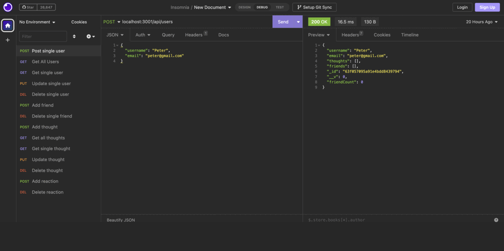

# 18 NoSQL: Social Network API

## Task

The idea is to use MongoDB to creat a social network API web application to take advantage of MangoDB's speed with large amounts of data, also its flexibility with the data that are unstructured.
This  application allows users to share their thoughts, create a friend list and to react to friends’ thoughts. 
And the ides is to seed your own data using Insomnia after you’ve created your API.

## User Story

```md
AS A social media startup
I need an API for the social network which uses a NoSQL database
To be able to habdle a large amounts of unstructured data
```

## Acceptance Criteria

```md
GIVEN a social network API
WHEN I enter the command to start the application
THEN my server is getting started and the Mongoose models will be synced to my MongoDB database
WHEN I open API GET routes for users and thoughts in the insomnia
THEN the data for each of the routes are shown in a formatted JSON
WHEN I test these API routes in Insomnia : POST, PUT, and DELETE 
THEN I am able to successfully create (POST), update (PUT), and delete (DELETE) users and thoughts in my database
WHEN I test API POST and DELETE routes in Insomnia
THEN I am successfully able to create and delete the reactions to thoughts and add and remove friends to or of a user’s friend list
WHEN I test API DELETE user
THEN application deletes a user's associated thoughts when the user is deleted.
```

## Mock Up

The following animations showing the application's API routes being tested in Insomnia.




A walkthrough video demonstrating the functionality of the application and all of the acceptance criteria being met is in here(https://youtu.be/3hCeSx364Ww)


## License

MIT License, Copyright (c) 2023 
